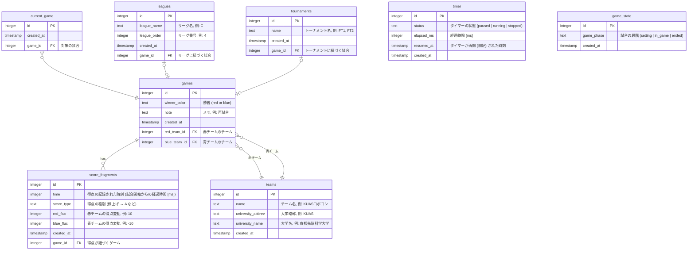

## スキーマ定義

### ER図

### current_game
現在のゲームを指すテーブル 
created_at が一番新しいやつが現在のゲーム
| id (integer) | game_id (integer) | created_at (timestamp) |
| --- | --- | --- |
| 1 | 224 | 2025-09-23 10:21:59|
| 2 | 210 | 2025-08-12 21:39:08|
### leagues
- バックエンドでトーナメントの対戦情報を取得するエンドポイントを用意 (毎度計算)  
- jsonから読みこんであとは定数  
- gameId は手動設定  

| id (integer) | name (text) | order (integer) | game_id (integer) |  created_at (timestamp) |
| --- | --- | --- | --- |   --- |  
| 13| A | 1 | 23 | |
|14| A | 2 |  24 ||
|15 | A | 3 | 25 | |
| ... | ... | ... |  ... | ...|
| 32 | G | 3 | 26 ||

### tournaments

- リーグ終了時点で手動入力
    - フロント側でこれを操作できるページが欲しい
- 対応する gameId を手動入力
- 既にトーナメント進出が決まっているチームを除いた中で上位2チーム，みたいなのもある
- name: T1 → トーナメント1回戦 など

| id (integer) | name (text) |game_id (integer) | created_at (timestamp) |
| --- | --- | --- | --- |
| 21 | T1 | 12312  ||  

### games

- 試合開始 or 終了時にフロントからleagueName, leagueOrderを入力して保存(間違えないよう十分注意を促すUIが必要)
    - するとgameIDとleagueId, winnerなどが紐づく
    - ミスなどで終了する試合は何とも紐づけない、なども可
    - note: 何で勝者が決まったか (得点 or 恣意)  など、備考

| id (integer) | red_team_id (integer) | blue_team_id (integer) |  winner_color (red \| blue) | note (text)  | created_at |
| --- | --- | --- | --- | --- |  --- |  
| 214 | 21 | 13 | red | ミス，再試合 ||
| 215 | ... | ... |  |ミスしたのでコピーで生成 ||
| 216 | ... | ... |  | |

### score_fragment
- fluc: 得点変動
- scoreType: 棟上げ→Aなど
    - https://github.com/Kansai-Robocon/score/blob/main/src/2025/scoreList.json
- time:  開始何秒後か [ms]

| id (integer) | game_id (integer) | team (text) | time (integer) | score_type (text) | red_fluc (integer) | blue_fluc (integer) | created_at |
| --- | --- | --- | --- | --- | --- | --- |  --- | 
| 1451 | 対象の試合ID | Red | 609  | A | 10 | -10 | |  
| 1452 | 対象の試合ID | Red | 621 | C | 20 | 0 |   |
| 1453 | 対象の試合ID | Blue | 689 | B | 0 | 10 |  |
| 1454 | 対象の試合ID | Blue | 805 | F | 0 | 30 |  |

### teams

- https://github.com/Kansai-Robocon/score/blob/main/src/2025/teamList.json
- チーム一覧

| id (integer) | name | university_name | university_abbrev | created_at|
| --- | --- | --- | --- |  --- |
| 42 | KUASロボコン | 京都先端科学大学 | KUAS | |

### timer

- タイマー管理
- グローバルに1レコードのみ存在
- 状態の考え方
    - status === "running"
        - 実際の経過時間 = elapsedMs + (now - resumedAt)
    - status === "paused"
        - elapsedMs が真の経過時間
        - resumedAt = null
    - status === "stopped"
        - elapsedMs を 0 にリセット
        - resumedAt = null

| id (integer) | status (text) | elapsed_ms (integer) | resumed_at (timestamp) | created_at (timestamp) |
| --- | --- | --- | --- |  --- |
| 1 | running | 42930 | 2025-12-05 14:00:00 | 2025-12-05 14:00:00 |

### game_state
- 試合の状態管理
- グローバルに1レコードのみ存在
- game_phase: setting | in_game | stopped

| id (integer) | game_phase (text) | created_at (timestamp) | 
| --- | --- | --- |
| 1 | in_game | 2025-12-05 14:00:00 |

## イベント設計
基本的にREST APIのエンドポイントは直接叩かず、socket.ioのイベントのみで通信する。
- 方向: C→S はクライアント発、S→C はサーバ発。
- 成功時 ack は `{}` または必要ペイロード、エラー時は `{ error: string }`。
- timestamp はすべて `timestampz(3)` の ISO 文字列 (例: `2024-02-01T10:30:45.123+09:00`)、時間系は ms 単位。

### game _(group)_
#### game:list (C→S)
- ペイロード: なし
- ack: `{ count: number, games: Game[] }`

#### game:get (C→S)
- ペイロード: `{ gameId: number }`
- ack: `{ count: number, games: Game[] }`（存在しない gameId はエラー）

#### game:create (C→S)
- ペイロード: `{ winnerColor: "red"|"blue"|null, note: string, redTeamId: number, blueTeamId: number }`
- ack: `{ id: number }`（作成 ID を返す）

#### game:setWinner (C→S)
- ペイロード: `{ id: number, winnerColor: "red"|"blue"|null }`
- ack: `{}`

#### game:setNote (C→S)
- ペイロード: `{ gameId: number, note: string }`
- ack: `{}`

#### game:setTeams (C→S)
- ペイロード: `{ gameId: number, redTeamId: number, blueTeamId: number }`
- ack: `{}`

#### game:update (C→S)
- ペイロード: `{ id: number, winnerColor: "red"|"blue"|null, note: string, redTeamId: number|null, blueTeamId: number|null }`
- ack: `{}`

#### game:updated (S→C)
- ペイロード: `{ updatedGame: Game }`
- ack: なし

### scoreFragment _(group)_
#### scoreFragment:list (C→S)
- ペイロード: `{ gameId: number }`
- ack: `{ count: number, scoreFragments: ScoreFragment[] }`

#### scoreFragment:add (C→S)
- ペイロード: `{ time: number, scoreType: string, redFluc: number, blueFluc: number, gameId: number }`
- ack: `{ id: number }`

#### scoreFragment:update (C→S)
- ペイロード: `{ id: number, time: number, scoreType: string, redFluc: number, blueFluc: number, gameId: number }`
- ack: `{}`

#### scoreFragment:delete (C→S)
- ペイロード: `{ id: number }`
- ack: `{}`

#### scoreFragment:updated (S→C)
- ペイロード: `{ scoreFragments: ScoreFragment[] }`
- ack: なし
- 備考: 該当 socket がサブスクライブしている gameId の全件を送信。リソース更新時に発火。

### team _(group)_
#### team:list (C→S)
- ペイロード: なし
- ack: `{ count: number, teams: Team[] }`
- 備考: read-only（seed で投入）

### tournament _(group)_
#### tournament:list (C→S)
- ペイロード: なし
- ack: `{ count: number, tournaments: Tournament[] }`

#### tournament:setGame (C→S)
- ペイロード: `{ tournamentId: number, gameId: number }`（存在しない id はエラー）
- ack: `{}`

#### tournament:updated (S→C)
- ペイロード: `{ tournaments: Tournament[] }`
- ack: なし
- 備考: リソース更新時に発火。

### league _(group)_
#### league:list (C→S)
- ペイロード: なし
- ack: `{ count: number, leagues: League[] }`

#### league:setGame (C→S)
- ペイロード: `{ leagueId: number, gameId: number|null }`（存在しない id はエラー、null で解除）
- ack: `{}`

#### league:updated (S→C)
- ペイロード: `{ leagues: League[] }`
- ack: なし
- 備考: リソース更新時に発火。

### gameTimer _(group)_
#### gameTimer:get (C→S)
- ペイロード: なし
- ack: `{ phase: "setting"|"in_game"|"ended", timerStatus: "running"|"paused"|"stopped", elapsedMs: number, resumedAt: string|null }`

#### gameTimer:resume (C→S)
- ペイロード: なし
- ack: `{}`

#### gameTimer:pause (C→S)
- ペイロード: なし
- ack: `{}`

#### gameTimer:skip (C→S)
- ペイロード: なし
- ack: `{}`
- 挙動: phase を `setting → in_game → ended → setting` で遷移し、`timerStatus` を `stopped` にする。

#### gameTimer:reset (C→S)
- ペイロード: なし
- ack: `{}`

#### gameTimer:updated (S→C)
- ペイロード: `{ phase: "setting"|"in_game"|"ended", timerStatus: "running"|"paused"|"stopped", elapsedMs: number, resumedAt: string|null }`
- ack: なし
- 備考: リソース更新時に発火。

### currentGame _(group)_
#### currentGame:get (C→S)
- ペイロード: なし
- ack: `{ gameId: number|null }`

#### currentGame:set (C→S)
- ペイロード: `{ gameId: number|null }`（存在しない id はエラー）
- ack: `{}`

#### currentGame:updated (S→C)
- ペイロード: `{ gameId: number|null }`
- ack: なし
- 備考: リソース更新時に発火。

## アーキテクチャ
試合の対戦チームや得点などは各試合レコードに紐付けられている一方で、タイマーや現在の試合段階 (セッティングタイムか試合中か) などの変動状態 (=: runtime state) は、試合レコードとはライフタイムを切り離して、グローバルに管理する。

 セマンティック的には、 runtime state は現在アクティブな試合についての状態を表す。

具体的な  runtime state としては、

 - 現在のタイマーの値
 - セッティングタイム中か、試合中か、試合外か
 - タイマーは停止中か、進行中か
 
などがある。

## 画面

https://www.figma.com/board/EA6WuF11EA4BiLhkugMzsi/春ロボツール2026?node-id=0-1&p=f&t=JLMpHHjdcN0ZKEEu-0

+ 現地の配信表示画面
+ OBSで切り抜く画面
+ トーナメント各試合へgame紐付け画面
+ リーグ結果へgame紐付け画面

## メモ

